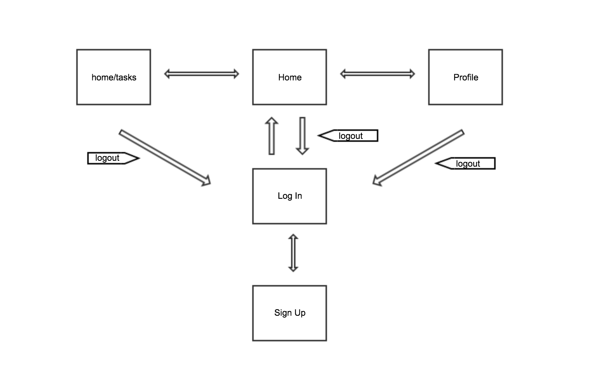

Bo Peng   

# Personal TO-DO List

## Overview

My ToDo App allows users to create their account and create as many groups and todo's needed 
to get you going. It includes various inspirational quotes to motivate you as you complete 
your tasks.

To Run: 
- npm install the dependencies
- run by 'node app.js' with mongodb open

## Data Model

This project will store Users and ToDos

* users can have multiple groups (categories)
* each group can have multiple items

An Example User:

```javascript
{
  username: "bopeng",
  pass: // user's password
  image: "bopeng.jpg"
  todos: // array or list of user todos
}
```

An Example List inside todos:

```javascript
{
  user: //to the corresponding user
  name: "Birthday",
  items: [
    { task: "go buy friend a gift", checked: false },
    { task: "get to best buy by 5pm", checked: true }
  ]
}
```

## [Link to Commented First Draft Schema](src/db.js) 


## Site map



## User Stories or Use Cases

1. as non-registered user, I can register a new account with the site
2. as a user, I can log in to the site
3. as a user, I can create a new todo category
4. as a user, I can view all of the categories (default) or view only tasks from all the groups
5. as a user, I can add tasks to group
6. as a user, I can cross off items I have completed and press delete button to get rid of it

